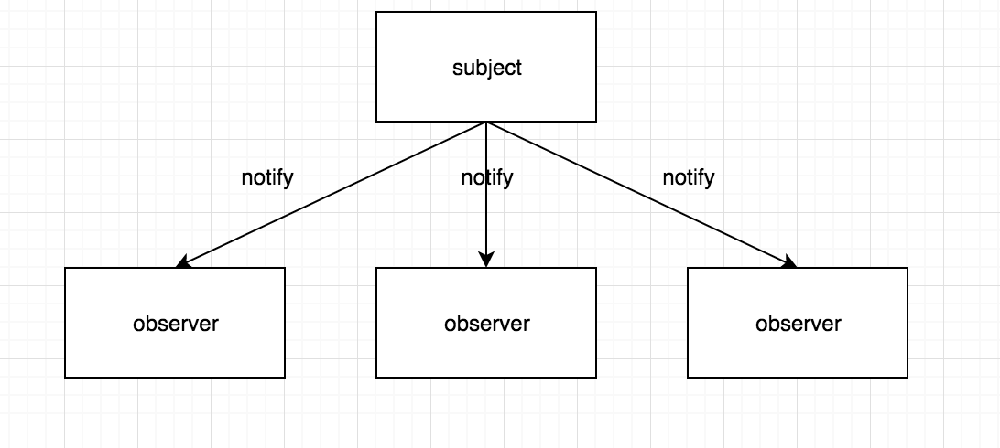

# 观察者模式



如上图观察者模式定义了一种一(subject)对多(observer)的关系，当一个对象被修改后，会自动地通知它依赖的对象。

###实现subject

```javascript
var Subject = function(){
    this.observerList = []
}

Subject.prototype.addObserver = function(observer){
    this.observerList.push(observer)
}

Subject.prototype.removeObserver = function(observer){
    var index = this.observerList.indexOf(observer)
    this.observerList.splice(index, 1)
}

Subject.prototype.notifyAllObservers = function(){
    this.observerList.forEach(function(observer){
        observer.notify()
    })
}

Subject.prototype.setPrice = function(price){
    this.price = price
    this.notifyAllObservers()
}
```

当subject实例中price发送了改变，会通知它所依赖的所有observer，可以通过removeObserver删除依赖。

### 实现observer

```javascript
var Observer = function(name){
  this.name = name
}
Observer.prototype.notify = function(price){
    console.log('observer' + this.name + ': ' + price)  
}
```

由于subject调用了notify方法，所以需要在observer中实现此方法。当然给实例后的observer添加notify方法也是可行的如：

```javascript
var o = new Observer(1)

o.notify=function(){}
```

让price发生变化，看下结果吧

```javascript
var o1 = new Observer(1)
var o2 = new Observer(2)
var o3 = new Observer(3)

var s = new Subject()

s.addObserver(o1)
s.addObserver(o2)
s.addObserver(o3)
s.removeObserver(o2)

s.setPrice(20) 
// observer 1: 20 
// observer 3: 20
```

结果：subject所有依赖的observer都打印出来了，而被删除的则不会打印。

**这样一个简单的观察者模式的例子就实现了**。