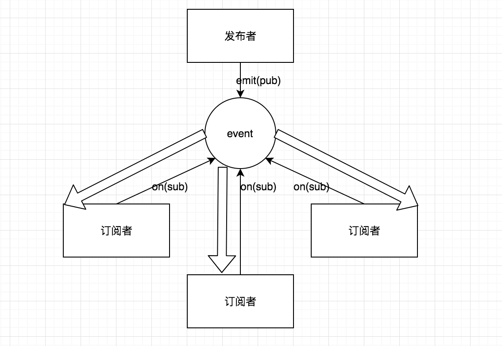

# 订阅发布者模式



当订阅者订阅了一些内容后，一旦内容有更新发布者会统一发布这些内容给对应的订阅者，听起来有些抽象，我们慢慢拆分，先看下订阅者吧：

```javascript
我们有如下需求，小王小李小张都想吃水果，但水果是一天中的某个时候才会送来，所以他们分别订阅了这个事情
var xiaowang = {'eat-fruit': function(){
  console.log('小王开始吃水果')
}}

var xiaoli = {'eat-fruit': function(){
  console.log('小李开始吃水果')
}}

var xiaozhang = {'eat-fruit': function(){
  console.log('小张开始吃水果')
}}

// 当水果送来时执行以下方法
xiaowang['eat-fruit']() // 小王开始吃水果
xiaoli['eat-fruit']() // 小李开始吃水果
xiaozhang['eat-fruit']() // 小张开始吃水果
```

可以看到这些人想做的事都一样，可以稍微优化一下：

```javascript
var event = {
  'eat-fruit': [
    function(){
      console.log('小王开始吃水果')
    },
    function(){
      console.log('小李开始吃水果')
    },
    function(){
      console.log('小张开始吃水果')
    }
  ]
}

event['eat-fruit'].forEach(function(fn){fn()})
// 小王开始吃水果
// 小李开始吃水果
// 小张开始吃水果
```

我们把这些人想做的事看成是订阅，把循环执行fn看成是发布，这样就可以写出个订阅发布者模式啦：

```javascript
var Event = function(){
  this.obj = {}
}

Event.prototype.on = function(key, fn){
  this.obj[key] = this.obj[key] || []
  this.obj[key].push(fn)
}
Event.prototype.off = function(){}
Event.prototype.emit = function(key, data){
  this.obj[key].forEach(function(fn){
    fn(data)
  })
}

var event = new Event()
event.on('eat-fruit', function(data){
  console.log('小王开始' + data)
})
event.on('eat-fruit', function(data){
  console.log('小李开始' + data)
})
event.on('eat-fruit', function(data){
  console.log('小张开始' + data)
})

event.emit('eat-fruit', '吃水果')
// 小王开始吃水果
// 小李开始吃水果
// 小张开始吃水果
```

### 和观察者的区别

* 观察者中subject和observer是依赖关系，在subject调用observer的方法（notify），而observer中也需要实现它。而发布/订阅模式中没有依赖关系，通过事件来控制，当数据发生变化只需要emit就好了。也就是说subject要关心observer，而发布/订阅模式中publisher和subscriber不用互相知道对方。
* 观察者模式用于同步操作，而发布/订阅模式可用于异步操作。
* 发布/订阅模式可以作用于多个应用之间的数据通信。

### 参考资料

[Observer vs Pub-Sub pattern](https://hackernoon.com/observer-vs-pub-sub-pattern-50d3b27f838c)


